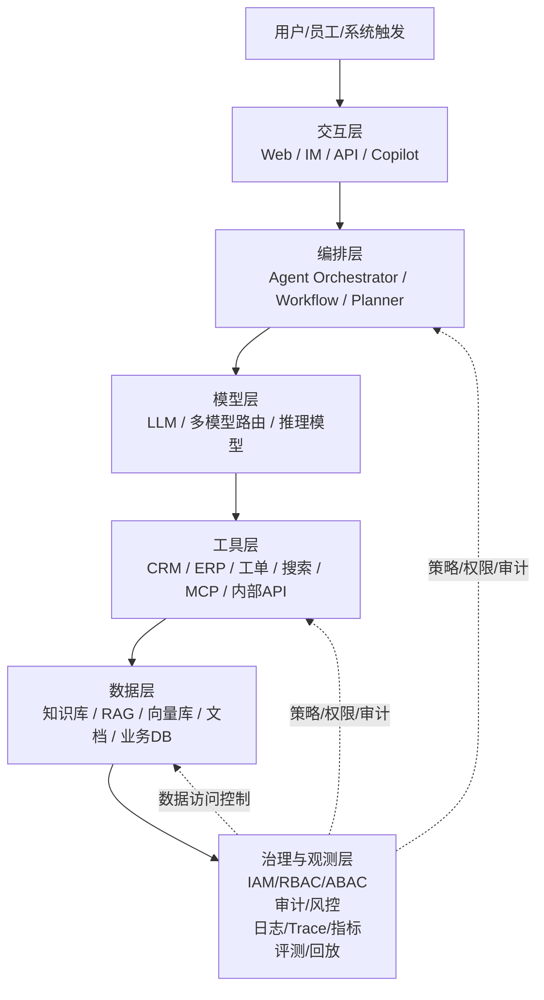

# 注意力 / 交叉注意力 / 与 Cross-Encoder Reranker 的关系（知识沉淀）

## 1. 注意力（Attention）基本形式
注意力机制本质：用查询 Q 从一组信息（K/V）中按相关性加权聚合。

公式：
- Attention(Q, K, V) = softmax(QK^T / sqrt(d)) V

含义：
- Q（Query）：当前需要的信息
- K（Key）：每条信息的索引/匹配依据
- V（Value）：每条信息的内容

## 2. 自注意力（Self-Attention）
定义：Q/K/V 都来自同一个序列（同一段文本/同一批 token）。
作用：让每个 token 融合序列内部上下文信息（长距离依赖、指代、组合语义等）。

## 3. 交叉注意力（Cross-Attention）
定义：Q 来自序列 A，K/V 来自序列 B（两个不同来源的信息交互）。
常见于 encoder-decoder、多模态、条件生成：
- 解码器 token（Q）去“看”编码器输出（K/V）
- 文本 token（Q）去“看”图像特征（K/V）
- 生成时（Q）去“看”检索上下文/外部记忆（K/V）

## 4. 一句话区分
- 自注意力：同一序列内部 token 互相“看”
- 交叉注意力：一个序列去“看”另一个序列/模态的信息

## 5. 与 Cross-Encoder Reranker 的关系（易混点）
Cross-Encoder reranker 通常把 query 和 doc 拼接成一个序列：
- [CLS] query [SEP] doc [SEP]
然后主要通过 **自注意力** 在同一序列内实现 query-doc 的细粒度交互。

注意：Cross-Encoder 的 “cross” 多指 query 与 doc 在同一模型中交互，并不一定意味着模型结构里显式存在 cross-attention 层；显式 cross-attention 更常见于 encoder-decoder 架构。# Hindsight（事后回溯）在 RAG/Agent 中的设计哲学与架构（知识沉淀）

## 1. 设计哲学（Principles）
### 1.1 先生成，再回溯（Generate → Reflect → Retrieve → Revise）
- 用户问题往往不完整；第一次检索也可能不准。
- 先生成初稿，让初稿暴露：关键实体/术语/编号、缺失前提、需要引用支撑的断言、不确定点/冲突点。
- 用这些“事后线索”构造更聚焦的检索 query，再检索并修订。

### 1.2 把失败/不确定当作信号（Signals）
- 没证据、引用不足、答案含糊、冲突点：触发下一轮检索与校验，而不是直接结束。

### 1.3 证据优先（Evidence-first）
- 回溯检索用于证实/证伪初稿断言、补齐缺口、发现并解释冲突来源。

### 1.4 结构化中间产物（可控回溯）
- 将初稿拆成结构化对象：Claims（断言）、Open Questions（待确认）、Entities（实体/字段/编号）、Required Citations（需引用句子）。
- 避免回溯退化为“再问一次”。

### 1.5 预算与收益可控（Stop conditions）
- 最大轮次（如 2~3 轮）、触发阈值（如引用覆盖率 < 80%）、早停条件（证据足够/冲突无法消解/超时）。

---

## 2. 架构设计（Architecture Modules）
1) Draft Generator（初稿生成器）
- 输入：用户问题 + 初次检索上下文
- 输出：初稿 + 结构化中间产物（claims/questions/entities）

2) Hindsight Analyzer（回溯分析器）
- 输入：初稿/claims + 当前证据集合
- 输出：检索计划（queries）、需补证的 claim、冲突点

3) Parallel Retriever（多路并行检索器）
- 输入：queries（多条）
- 输出：候选证据集合（chunks/docs）

4) Fusion + Reranker（融合与精排）
- 融合：RRF/去重/多字段权重
- 精排：cross-encoder reranker（如 bge-reranker）

5) Verifier / Grounder（证据对齐与校验）
- claim ↔ evidence 对齐
- 引用覆盖率、冲突检测
- 输出“可引用证据包”

6) Reviser（修订器）
- 输入：初稿 + 新证据包 + 冲突说明
- 输出：最终答案（带引用/可追溯）

7) Controller（闭环控制器）
- 决定是否进入下一轮 hindsight
- 控制预算、轮次、超时
- 记录 trace（可观测性）

---

## 3. 典型数据流（两轮示例）
- Round 0：初次检索（BM25/向量/混合）→ rerank → context0
- Round 1：生成初稿 draft0 → 抽取 claims/questions/entities
- Round 1：基于 claims/缺口生成 queries → 并行检索 → 融合去重 + rerank → context1
- Round 1：校验（coverage/冲突）→ 修订输出 final（或进入 Round 2）

---

## 4. 回溯触发器（Signals）建议
- 引用覆盖率不足（如 < 80%）
- 不确定措辞过多（可能/大概/通常/建议等）
- 冲突检测（同一字段多个值）
- 用户要求出处/依据/链接
- 结构化输出缺字段（如缺错误码、缺范围）

---

## 5. 工程要点
- 多路并行检索是 hindsight 的放大器：原 query + claim-based query + keyword query + 反向 query。
- 必须做可观测性：每轮记录触发原因、queries、命中文档、claims 的证实/证伪/未知状态。
# 智能体记忆：更新时机与记忆架构使用方式（知识沉淀）

## 1) 记忆更新时机（When to write）
### 1.1 事件驱动（推荐）
在出现以下事件时写入长期记忆：
- 用户明确表达偏好/硬约束：如输出语言、格式要求、必须返回 download_url 等
- 稳定事实（Profile/环境）：部署方式、数据库/向量库类型、项目结构、端口/域名
- 可复用的结论/决策：如“filename* 处理非 latin-1 文件名”“exec(compiled, g, g) 解决 NameError”
- 任务完成后的产物摘要：接口规范、关键代码片段、配置片段
- 错误复盘（postmortem）：根因 + 修复方式 + 避免再次发生的规则

### 1.2 阈值/质量驱动（防噪声）
满足条件才写入：
- 用户确认（“是/对/就这么做”）
- 重复出现 ≥2 次
- 对未来有明显收益（减少反复确认/减少踩坑）

### 1.3 回合边界与任务边界
- turn-end：每轮结束抽取“候选记忆”，不一定写入
- task-end：任务完成后写入“最终决策/最终配置/最终接口”

### 1.4 明确指令触发
用户明确说“沉淀/落盘/写到知识库”时强制写入（最干净的写入时机）。

---

## 2) 记忆架构（How to use）
### 2.1 分层架构（推荐）
- Working Memory（短期）：当前对话上下文、最近 N 轮消息、当前任务状态（一次会话生命周期）
- Episodic Memory（情景）：本次如何解决某问题的摘要（带时间/项目/上下文），用于相似问题复用
- Semantic Memory（语义/知识）：可泛化规则、最佳实践、模板（如知识库 markdown）
- Procedural Memory（程序性）：固定流程/工作流（如“生成 Excel→校验 out_exists/out_size→返回 download_url”），常以 Skill/Playbook 形式存在
- Profile Memory（画像/偏好）：语言、格式偏好、环境信息、禁忌项

### 2.2 读写路径（典型闭环）
写入（Write）：
- 对话/工具结果 → Memory Extractor（抽取）→ Memory Judge（是否值得写）→ Store（存储）

读取（Read）：
- 新问题 → Memory Retriever（语义/标签检索）→ Rerank → 注入 system prompt / tool context

### 2.3 存储形态（工程常见）
- KV/JSON：Profile、偏好、固定配置（稳定、可控）
- 向量库：Episodic/Semantic（语义检索）
- 文档库/Markdown：可审计、可版本化（适合知识沉淀）
- 图/关系库：实体关系强的场景

---

## 3) 更新 vs 只读：推荐策略
- 默认：每轮抽取候选；用户确认/任务完成再写入
- 失败复盘：优先写入（根因+修复）
- 纯闲聊：不写
- 临时信息（一次性 token、临时文件名）：不写或写入 episodic 并设置过期

---

## 4) 记忆污染防护（重要）
- 只写“用户确认过的事实/决策”
- 为记忆加 metadata：source（user_confirmed/tool_output/assumption）、时间戳、适用范围
- 支持更正/覆盖：用户否定时更新或撤销旧记忆

---

## 5) 与现有工程的结合建议
- Skills（SKILL.md）= 程序性记忆（流程/规范）
- knowledge_all.md = 语义记忆（规则/坑点/模板）
- 建议补一个轻量 Profile/Config KV：如 PUBLIC_BASE_URL、是否反代、下载路由前缀等，避免反复踩坑。
# 🧠 可行性方案：基于 Hindsight 记忆框架的代码助手/软件助手（用户稿沉淀）

## 1. 方案目标
将 **Hindsight 记忆框架** 用于代码助手/软件助手场景，使助手具备：
- **长期记忆**：记住用户项目、技术栈、编码风格、历史决策
- **情境记忆**：理解当前仓库、当前任务、当前分支、当前报错
- **反思记忆**：从过去失败、修复、重构中总结经验
- **可控遗忘**：避免记忆污染、过时信息干扰、隐私泄露

目标是打造“越用越懂你”的开发助手，而非简单聊天机器人。

---

## 2. Hindsight 在代码助手中的含义
Hindsight = “事后回看、总结、沉淀经验，再用于未来决策”的记忆机制。保存的不只是对话，而是：

1) **事实记忆**
- 偏好语言/框架/技术栈
- 项目约束（不能引入新依赖、必须兼容旧版本等）

2) **过程记忆**
- 排查路径、修复步骤
- 被否决方案及原因

3) **结果记忆**
- 最终采用的实现
- 团队/用户偏好的代码风格
- 有效的测试策略

4) **反思记忆**
- 失败教训、风险提示
- 适用/不适用的技术选择经验

---

## 3. 可行性结论
### 3.1 结论：可行且价值高
代码场景天然具备：强上下文依赖、长周期迭代、重复性问题、个性化偏好、可沉淀经验模式。
适用场景：IDE 助手、代码审查、Bug 修复、架构建议、文档生成、测试生成。

### 3.2 前提条件
记忆必须：
- 结构化
- 可检索
- 有时效性
- 可解释
- 支持用户控制

否则会出现：记错项目、旧偏好干扰、记忆污染、建议失真。

---

## 4. 推荐系统设计
### 4.1 总体架构（四层）
A. 会话层：当前对话/任务/代码片段即时理解
B. 记忆层：用户画像/项目/任务/经验记忆
C. 反思层：对任务结果总结形成 hindsight 记忆（成功/失败/模式/风险）
D. 决策层：回答前检索记忆并结合当前上下文输出

### 4.2 记忆类型设计
| 记忆类型 | 内容示例 | 用途 |
|---|---|---|
| 用户偏好记忆 | 喜欢简洁代码、偏好 Python | 个性化回答 |
| 项目记忆 | monorepo、使用 PostgreSQL | 方案匹配 |
| 任务记忆 | 上次修复登录超时 | 连续任务 |
| 经验记忆 | 空指针检查优先 | 风险规避 |
| 反思记忆 | 重构回归因测试不足 | 经验沉淀 |

---

## 5. Hindsight 记忆工作流程
### 5.1 写入流程（任务完成后总结）
- 提取：任务目标、关键上下文、采取方案、结果、失败点/成功点
- 生成：可检索的记忆条目（而非全量对话）

示例（接口超时）：
- 项目：支付服务
- 问题：接口超时
- 原因：索引缺失
- 解决：新增联合索引、减少 N+1
- 经验：先查慢查询/索引，再看网络层
- 偏好：先给最小修复，再给优化建议

### 5.2 检索流程（新任务到来）
- 检索：项目相关记忆、相似 bug、用户偏好、未完成任务
- 再生成：更贴合实际的排查/修复方案

---

## 6. 适合落地的功能模块
1) 代码理解助手：解释代码、总结模块依赖、标注风险；记忆仓库结构/模块职责演化
2) Bug 修复助手：分析报错、排查路径、生成补丁、回归测试建议；记忆常见故障模式与回归风险
3) 代码审查助手：风格/安全/性能/可维护性；记忆团队规范与审查偏好
4) 架构建议助手：模块拆分、API 设计、技术选型、扩展性；记忆历史架构决策与兼容约束

---

## 7. 可行性评估
- 技术可行性：高（检索/向量/结构化存储/过滤成熟；hindsight 可用“任务后总结”落地）
- 产品可行性：高（开发者强需求；重复率高；长期价值明显）
- 风险可控性：中高（需治理：污染/过期/隐私/噪声/过度个性化）

---

## 8. 风险与应对
| 风险 | 表现 | 应对策略 |
|---|---|---|
| 记忆污染 | 临时上下文当长期偏好 | 分级、置信度 |
| 过时记忆 | 旧偏好影响新项目 | 时间衰减、版本标记 |
| 隐私泄露 | 记住敏感代码/密钥 | 脱敏过滤 |
| 检索噪声 | 记忆太多干扰 | 排序、上限控制 |
| 过度个性化 | 忽略通用最佳实践 | 个性化+标准建议并行 |

---

## 9. 推荐实现方案
### 9.1 MVP（最小可行）
先做三类记忆：
1) 用户偏好记忆
2) 项目记忆
3) 任务总结记忆

MVP 功能：自动记录偏好、自动总结任务、按项目检索、用户可查看/删除。

### 9.2 进阶
加入：反思引擎、失败案例库、代码模式库、团队规范库、多项目隔离、置信度与衰减。

---

## 10. 数据结构建议（结构化 + 向量化混合）
结构化字段：
- memory_id, user_id, project_id, memory_type, content, timestamp, confidence, ttl, tags, source_task_id

示例：
```json
{
  "memory_id": "m_1024",
  "user_id": "u_01",
  "project_id": "p_payments",
  "memory_type": "experience",
  "content": "该项目接口超时优先检查慢查询与索引，而不是先改网络层。",
  "timestamp": "2026-07-08T10:00:00Z",
  "confidence": 0.86,
  "ttl": 180,
  "tags": ["bugfix", "performance", "postgresql"]
}
```

---

## 11. 评估指标
- 任务完成率
- 重复提问减少率
- 建议采纳率
- 用户纠正记忆次数
- 检索命中率
- 错误记忆率
- 用户满意度
- 平均修复时间缩短比例

---

## 12. 落地建议
- 先从轻记忆开始：偏好/项目上下文/最近 5 次任务总结
- 记忆必须可视化：用户可查看/删除
- 记忆要带来源：可追溯到任务/对话/代码片段/修复结果
- 记忆分层：短期（会话）/中期（项目）/长期（偏好与经验）

---

## 13. 分阶段路线
1) 第一阶段：会记住项目和偏好的助手
2) 第二阶段：加入 hindsight 反思机制（任务后总结经验）
3) 第三阶段：记忆治理（过期清理、置信度、用户控制、隐私保护）
4) 第四阶段：记忆与工具调用结合（代码搜索、测试执行、静态分析、仓库索引、issue 检索）

---

## 14. 一句话结论
Hindsight 记忆框架用于代码助手可行且非常适合打造“越用越懂项目、越用越懂开发者”的软件助手；关键在于记忆的结构化、可检索、可遗忘、可解释与用户可控。
# 企业级 AI Agent：架构与能力清单（沉淀）

## 1. 总体架构（六层）
企业级 AI Agent 通常分为六层：**交互层、编排层、模型层、工具层、数据层、治理与观测层**。生产级 Agent 不是单一模型，而是围绕任务编排、工具调用、企业数据接入、安全治理和可观测性构建的系统。

### 1.1 架构示意（文本）
```
用户 / 员工 / 系统
        ↓
交互层（Web / IM / API / Copilot）
        ↓
编排层（Agent Orchestrator / Workflow / Planner）
        ↓
模型层（LLM / 多模型路由 / 推理模型）
        ↓
工具层（CRM / ERP / 工单 / 搜索 / MCP / 内部 API）
        ↓
数据层（知识库 / RAG / 向量库 / 文档 / 业务数据库）
        ↓
治理与观测层（身份、权限、审计、风控、日志、评测）
```

### 1.2 各层职责
#### 1) 交互层
- 承接用户输入与系统触发：Web、企业 IM、API、邮件/工单/RPA 触发器
- 目标：**标准化任务入口**，便于治理与审计（而非“让模型直接回答”）

#### 2) 编排层（Agent 的“大脑外壳”）
- 任务拆解、规划步骤
- 决策是否调用工具
- 多轮状态管理
- 失败重试/降级
- 人工审批分支

#### 3) 模型层
- 单一大模型或**多模型路由**
- 便宜模型做分类/路由，强模型做复杂推理
- 专用模型做抽取、检索、代码执行等

#### 4) 工具层（真正“做事”）
- CRM/ERP/工单/邮件/日历/搜索/内部 API
- MCP Server
- 代码执行沙箱

#### 5) 数据层
- 文档库、FAQ
- 向量数据库（Vector DB）
- 数据仓库/结构化业务表
- 实时事件流
- 通过 RAG 将私有数据安全接入 LLM，提升准确性、降低幻觉

#### 6) 治理与观测层（企业级 vs Demo 的关键差异）
- 身份与权限控制（最小授权）
- 审计日志
- 监控与追踪（logs/trace/metrics）
- 评测体系
- 风险策略、合规控制
- 人工接管

### 1.3 更贴近落地的架构示意
```
[用户]
  ↓
[入口层：Web / IM / API]
  ↓
[Agent 编排器]
  ├─ 任务分解
  ├─ 工具选择
  ├─ 状态管理
  ├─ 人工审批
  └─ 错误恢复
  ↓
[模型路由]
  ├─ 轻量模型
  ├─ 推理模型
  └─ 专用模型
  ↓
[工具执行层]
  ├─ 内部 API
  ├─ SaaS 系统
  ├─ MCP Server
  └─ 沙箱代码执行
  ↓
[知识与数据层]
  ├─ RAG
  ├─ 向量库
  ├─ 文档库
  └─ 业务数据库
  ↓
[治理与观测层]
  ├─ IAM / RBAC
  ├─ 审计日志
  ├─ 监控告警
  ├─ 安全策略
  └─ 评测与回放
```

## 2. 设计要点（落地原则）
1) **Agent 不应直接连所有系统**：通过网关、权限控制、工具白名单，避免越权访问。
2) **高风险动作必须有审批**：如付款、删库、权限变更、对外发邮件等，建议人工确认或双人审批。
3) **先做“窄而深”的场景**：优先高频、规则清晰、结果可验证、风险可控的场景，优于一开始做“万能助手”。

## 3. 企业级 AI Agent 能力清单（PRD 视角）

### A. 功能能力
1) **任务理解与规划**
- 理解自然语言目标
- 拆解子任务
- 生成执行计划
- 判断是否需要工具
- 支持多轮上下文

2) **工具调用**
- 调用内部 API
- 调用外部 SaaS
- 访问知识库
- 执行代码/脚本
- 工具失败重试

3) **业务流程编排**
- 串联多个系统
- 条件分支
- 并行任务
- 人工审批节点
- 定时/事件触发

4) **知识增强**
- RAG 检索
- 文档引用
- 企业知识库问答
- 结构化数据查询

5) **结果输出**
- 生成报告
- 填写工单
- 更新 CRM/ERP
- 发送通知
- 生成可追踪的操作记录

### B. 企业级非功能能力
1) **安全**
- 身份认证、权限控制、最小授权
- 密钥管理、数据脱敏
- 提示注入防护、越权检测

2) **治理**
- 审批流、责任归属
- 使用范围定义
- 模型与工具白名单
- 生命周期管理、合规策略

3) **可观测性**
- 日志、Trace、指标、告警
- 回放、审计报表

4) **可靠性**
- 超时控制、重试机制
- 幂等设计、降级策略
- 人工接管、失败补偿

5) **评测与优化**
- 离线评测、在线评测
- A/B 测试
- 成功率/任务完成率统计
- 成本监控
- 幻觉率分析

### C. 平台化能力
1) **Agent Registry**：统一管理 Agent/工具/MCP Server/版本/权限/所属业务线
2) **Agent Identity**：每个 Agent 独立身份，便于授权、审计、追责、风控
3) **Agent Gateway**：统一控制工具调用、策略执行、认证授权、内容保护
4) **评测平台**：自动评测、人工标注、回放测试、线上监控、质量看板

## 4. PRD 编写顺序建议
- 业务目标
- 适用场景
- Agent 角色与边界
- 可调用工具清单
- 权限与审批规则
- 数据来源与知识库
- 失败处理与人工接管
- 日志、审计与监控
- 评测指标
- 上线与运维流程


---
# 企业级 AI Agent 交付物模板（Mermaid 架构图 / PRD / 安全治理检查表 / 技术选型）

## 1) 企业级 AI Agent 架构图（Mermaid 版）

### 1.1 六层总体架构


### 1.2 更贴近落地：编排器 + 模型路由 + 工具网关

```mermaid
flowchart LR
  subgraph Entry[入口层]
    Web[Web]:::c
    IM[企业IM]:::c
    API[API]:::c
    EVT[事件/定时/工单触发]:::c
  end

  subgraph Orchestrator[Agent 编排器]
    P[Planner/任务分解]:::a
    S[State/上下文与会话]:::a
    A[Approval/人工审批]:::a
    R[Retry/降级/补偿]:::a
  end

  subgraph ModelRouter[模型路由]
    C1[轻量模型
分类/意图/抽取]:::m
    C2[推理模型
复杂规划/决策]:::m
    C3[专用模型
OCR/Embedding/代码]:::m
  end

  subgraph Gateway[Agent Gateway / Tool Proxy]
    POL[策略引擎
白名单/速率/风控]:::g
    AUTH[认证授权
SSO/OAuth/RBAC]:::g
    AUD[审计与留痕]:::g
  end

  subgraph Tools[工具执行层]
    SaaS[SaaS: CRM/ERP/工单]:::t
    INT[内部API/微服务]:::t
    MCP[MCP Server]:::t
    SBX[沙箱执行
代码/脚本]:::t
  end

  subgraph Data[知识与数据层]
    RAG[RAG 检索]:::d
    VDB[向量库]:::d
    DOC[文档库/Wiki]:::d
    DB[业务数据库/数仓]:::d
  end

  subgraph Obs[治理与观测]
    LOG[日志/Trace/指标]:::o
    EVA[评测/回放/看板]:::o
    DLP[DLP/脱敏/PII]:::o
  end

  Web --> P
  IM --> P
  API --> P
  EVT --> P

  P --> C1 --> C2
  C2 --> POL
  POL --> AUTH --> AUD --> SaaS
  AUD --> INT
  AUD --> MCP
  AUD --> SBX

  C3 --> RAG
  RAG --> VDB
  RAG --> DOC
  RAG --> DB

  LOG -.观测.-> Orchestrator
  LOG -.观测.-> Gateway
  EVA -.质量.-> Orchestrator
  DLP -.数据保护.-> Data

  classDef c fill:#eef,stroke:#88a;
  classDef a fill:#efe,stroke:#8a8;
  classDef m fill:#ffe,stroke:#aa8;
  classDef g fill:#fef,stroke:#a8a;
  classDef t fill:#eef,stroke:#88a;
  classDef d fill:#eff,stroke:#8aa;
  classDef o fill:#f8f8f8,stroke:#999;
```


---

## 2) 企业级 AI Agent PRD 模板（可直接复制使用）

> 适用：内部提效助手 / 对外客服 Agent / IT 运维 Agent / 财务法务 Agent 等。建议每个 Agent 对应一份 PRD。

### 2.1 基本信息
- PRD 名称：
- 版本/日期：
- Owner（业务/产品）：
- Tech Owner（架构/研发）：
- 相关系统负责人：
- 上线范围（部门/租户/地区）：

### 2.2 背景与业务目标
- 背景问题：
- 目标（可量化）：
  - 效率：平均处理时长降低 X%
  - 质量：一次解决率提升 X%
  - 成本：单次任务成本 ≤ X 元
- 非目标（明确不做）：

### 2.3 用户与场景
- 目标用户：员工/客服/运维/销售/客户
- 典型场景（Top 3~5）：
  1. 场景名称：触发条件 → 输入 → 期望输出
  2. …
- 反场景/禁止场景：

### 2.4 Agent 角色定义与边界
- Agent 名称与职责：
- 能做（Do）：
- 不能做（Don’t）：
- 风险分级（建议）：
  - L0：只读问答（无工具写操作）
  - L1：低风险写操作（可自动执行）
  - L2：中风险（需用户确认）
  - L3：高风险（需人工审批/双人复核）

### 2.5 交互与入口
- 入口：Web/IM/API/工单/定时任务
- 交互方式：对话式/表单式/混合
- 输出形态：自然语言 + 结构化（JSON/表格）+ 可追溯引用

### 2.6 数据与知识（RAG）
- 数据源清单：文档库/Wiki/FAQ/DB/数仓/事件流
- 权限模型：按用户/部门/项目/租户过滤（RBAC/ABAC）
- 索引策略：增量同步频率、版本、过期策略
- 引用要求：是否必须给出处（强制/可选）

### 2.7 工具与系统集成
- 工具清单（白名单）：
  - 工具名 / 作用 / 读写权限 / 风险等级 / 负责人 / SLA
- 工具调用约束：
  - 幂等键、超时、重试、限流
  - 参数校验、输出校验
- 工具网关：是否统一走 Agent Gateway（强烈建议）

### 2.8 任务编排与流程
- 任务分解策略：Planner/Workflow/规则流
- 状态管理：会话状态、任务状态、长任务恢复
- 人工审批节点：触发条件、审批人、超时策略
- 失败处理：重试/降级/补偿/人工接管

### 2.9 模型策略
- 模型清单：
  - 轻量模型：意图识别/分类/抽取
  - 推理模型：复杂规划/决策
  - 专用模型：Embedding/OCR/代码
- 路由策略：按复杂度/成本/延迟/风险
- 输出约束：结构化输出 schema、禁止项、敏感词策略

### 2.10 安全与合规
- 身份认证：SSO/OAuth
- 授权：RBAC/ABAC、最小权限
- 数据保护：脱敏/DLP/PII
- 提示注入防护：外部内容隔离、工具参数白名单
- 审计：谁在何时以何权限做了什么

### 2.11 可观测性与运维
- 日志：对话、工具调用、检索命中、异常
- Trace：一次任务的全链路
- 指标：成功率、任务完成率、平均耗时、工具失败率、成本/Token
- 告警：阈值与通知渠道

### 2.12 评测与验收
- 离线评测集：覆盖场景、难例、对抗样本
- 在线评测：A/B、灰度策略
- 关键指标（建议）：
  - Task Success Rate
  - Groundedness/引用覆盖率
  - Hallucination Rate
  - Tool Success Rate
  - Cost per Task
- 验收标准：

### 2.13 发布与回滚
- 灰度策略：按部门/租户/比例
- 回滚策略：模型回滚、工具禁用、策略降级
- 变更记录：

---

## 3) 企业级 AI Agent 安全治理检查表（Checklist）

### 3.1 身份与权限
- [ ] 接入 SSO/OAuth，支持用户身份透传
- [ ] Agent 具备独立身份（Agent Identity），便于授权与审计
- [ ] RBAC/ABAC 落地：按租户/部门/项目/数据域隔离
- [ ] 最小权限：默认只读，逐项开通写权限

### 3.2 工具与执行安全
- [ ] 工具白名单（允许调用的工具/方法/参数范围）
- [ ] 工具网关（Agent Gateway）统一鉴权、限流、审计
- [ ] 幂等设计：写操作必须有幂等键/请求去重
- [ ] 超时/重试/熔断/降级策略明确
- [ ] 高风险动作（付款/删库/权限变更/对外发送）强制审批
- [ ] 沙箱隔离：代码执行/脚本执行与生产网络隔离

### 3.3 数据安全与隐私
- [ ] PII/敏感信息识别与脱敏（输入/输出/日志）
- [ ] DLP 策略：禁止外发敏感字段
- [ ] 密钥管理：KMS/Secret Manager，不在 Prompt/日志中泄露
- [ ] 数据出境与合规：地域、保留期、删除权

### 3.4 提示注入与内容安全
- [ ] 外部内容（网页/邮件/附件）与系统指令隔离
- [ ] 工具参数严格校验（schema + allowlist）
- [ ] 防越权：检索与工具调用均做权限过滤
- [ ] 输出约束：结构化 schema、禁止项、敏感词

### 3.5 审计与追责
- [ ] 审计日志：用户/Agent/时间/输入/工具调用/结果/影响范围
- [ ] 可回放：支持按 trace 回放一次任务
- [ ] 责任归属：Owner、审批人、系统负责人明确

### 3.6 质量与运行治理
- [ ] 离线评测集与回归机制
- [ ] 线上监控：成功率、幻觉率、工具失败率、成本
- [ ] 灰度发布与回滚预案
- [ ] 人工接管通道（HITL）

---

## 4) 企业级 AI Agent 技术选型建议（按层）

> 原则：先选“可治理、可观测、可回滚”的方案，再谈模型能力。

### 4.1 交互层
- 选型要点：统一入口、身份透传、会话与工单联动
- 常见方案：Web 控制台、企业 IM（飞书/企微/Slack/Teams）、API Gateway

### 4.2 编排层（Orchestrator）
- 选型要点：状态机/工作流、长任务、重试补偿、审批节点、可观测
- 方案类型：
  - 工作流优先（确定性强）：Temporal / Cadence / Argo Workflows / Airflow（偏批处理）
  - Agent 框架优先（灵活）：LangGraph / Semantic Kernel / 自研 Orchestrator
- 建议：高风险/强流程场景优先工作流；探索性任务可用 Agent 编排。

### 4.3 模型层
- 选型要点：多模型路由、成本/延迟、可控输出、私有化需求
- 组合建议：
  - 轻量模型：分类/抽取/改写
  - 推理模型：复杂规划与决策
  - Embedding 模型：RAG 向量化
- 关键能力：JSON schema 输出、函数调用/工具调用、可配置安全策略

### 4.4 工具层与 MCP
- 选型要点：工具标准化、权限与审计、失败可恢复
- 建议：
  - 统一 Tool Proxy/Agent Gateway
  - MCP 用于工具生态标准化（尤其多团队共建工具时）
  - 写操作必须幂等 + 审批

### 4.5 数据层（RAG）
- 选型要点：权限过滤、引用可追溯、增量更新、混合检索
- 组件建议：
  - 文档解析：PDF/Office/HTML 解析 + 分块策略
  - 检索：BM25 + 向量混合检索
  - 向量库：Milvus / pgvector / Elasticsearch Vector / Pinecone（按部署形态选）
  - 评测：检索命中率、引用覆盖率、groundedness

### 4.6 治理与观测层
- 选型要点：全链路 trace、审计、成本、质量看板、告警
- 建议：
  - Observability：OpenTelemetry + Prometheus/Grafana + 日志平台
  - 审计：独立审计库（不可篡改/可追溯）
  - 评测：离线基准集 + 线上回放 + A/B

### 4.7 落地路线（推荐）
1) 选 1 个窄场景（高频、可验证、低风险）
2) 先打通：入口 → 编排 → RAG → 只读工具
3) 上线观测与评测，再逐步开放写操作 + 审批
4) 多 Agent/多工具生态在第二阶段再扩展
